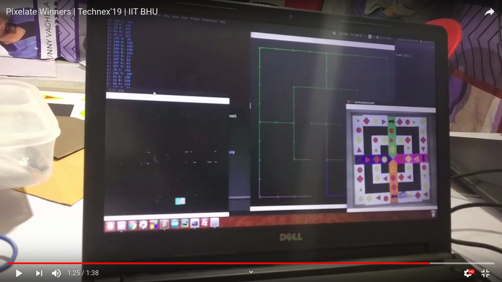

# Pixelate-2k19-Technex

This is the code that won us Pixelate-2k19, an image processing event with a hardware implementation for a ludo like maze.

Pixelate is an event under **TECHNEX**, the annual Techo-Management fest of IIT (BHU) Varanasi.

**Problem Statement**: Pixelate of Technex 2019, expected us to develop a robot for playing a ludo like game using the live feed from an overhead webcam feed. The detailed problem statement of **Pixelate-2019** can be found here - [Robonex_Pixelate.pdf](https://github.com/nishantkr18/Pixelate-2k19-Technex/blob/master/Robonex_Pixelate.pdf)

                  
                                                           
                                                           
**Our Solution**:
 
- We used OpenCV for shape detection and colour detection and then used it to get to the nearest shape as given out by the die roll.
- Then an optimal graph/path was plotted to get the optimal trajectory, connecting the centroids of all the shapes along the way to the destination shape.
- Once the path was received, we used PID (proportional–integral–derivative controller) to make our robot follow the line connecting all these dots. Individual PID parameters were used to make the robot go straight and as well take sharp 90 degree turns.

Check out the youtube video here:

This is a sample of the feed available from the overhead camera.

Here is a screenshot of the laptop when the code ran on it:

This is the robot we used in the event:

